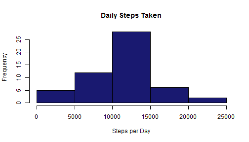
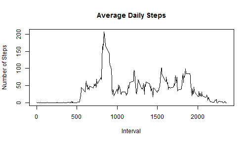
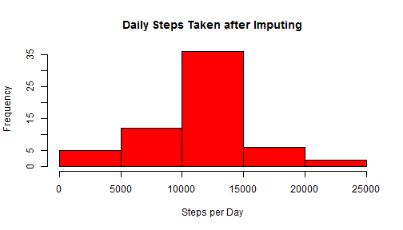
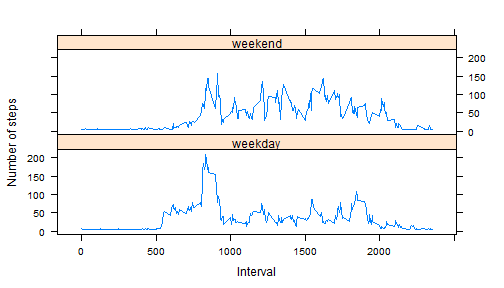

## Loading and preprocessing the data
(1) Load necessary libraries
(2) Read file
(3) Remove the NA data from data set


```r
## Libraries used in this code base
library (dplyr)
library (tidyr)
library (lubridate)
library (lattice)

## Read File 
activityData <- read.csv("activity.csv")
myDF <- as.data.frame(activityData)

## Excluding all 'NA's from the data set
validData <- myDF[!is.na(myDF$steps),]  
```

## What is mean total number of steps taken per day?
(1) Calculate the total number of steps taken per day
(2) Make a histogram of the total number of steps taken each day
(3) Calculate and report the mean and median of the total number of steps taken per day


```r
## Subset to necessary columns
newdata <- validData[,c(1,2)]

## Summarize 
summaryData <- newdata %>% group_by(date) %>% summarise_each(funs(sum))

## Perform Calculations
meanSteps <- as.character(round(mean (summaryData$steps), digits=2))
medianSteps <- as.character(round(median (summaryData$steps), digits=2))

## Plot Histogram
hist (summaryData$steps, col= "midnight blue", xlab= "Steps per Day", main = "Daily Steps Taken")
```

 

```r
## Provide answer to item 3 in inline code
```

The **mean value** for daily steps is 10766.19 and the **median value** is 10765

## What is the average daily activity pattern?
(1) Make a time series plot (i.e. type = "l") of the 5-minute interval (x-axis) and the average number of steps taken, averaged across all days (y-axis)
(2) Which 5-minute interval, on average across all the days in the dataset, contains the maximum number of steps?


```r
## Subset to necessary columns
newdata <- validData[,c(1,3)]

## Summarize 
summaryData <- newdata %>% group_by(interval) %>% summarise_each(funs(mean))

## Perform Calculations
maxSteps <- summaryData[which (summaryData$steps == max (summaryData$steps)),1]

## Plot Line Graph
plot(summaryData$interval, summaryData$steps,type="l", main= "Average Daily Steps", xlab = "Interval", ylab = "Number of Steps") 
```

 

```r
## Provide answer to item 2 in inline code
```

The **max number of steps** were at the 835th interval

## Imputing missing values
(1) Calculate and report the total number of missing values in the dataset (i.e. the total number of rows with NAs)
(2) Create a new dataset that is equal to the original dataset but with the missing data filled in.
(3) Make a histogram of the total number of steps taken each day 
(4) Calculate and report the mean and median total number of steps taken per day. 
(5) Do these values differ from the estimates from the first part of the assignment? What is the impact of imputing missing data on the estimates of the total daily number of steps?


```r
## Count the number of NA values in data set
imputData <- as.data.frame(activityData)
a<-count(imputData, is.na(imputData$steps))

## Calculate value for report out
colnames(a) <- c("value", "count")
NAvalues <- a[which(a$value), 2]
```
There are 2304 NA values in the data set


```r
## Calculate substitution value 
assumedSteps <- round(mean (mean(imputData$steps, na.rm = TRUE)), digits=0) 
```

Missing Data will be substituted with average number of steps across entire dataset. Calculated Value is 37


```r
## Make Substitution
imputData$steps[is.na(imputData$steps)] <- assumedSteps

## Subset to necessary columns
newdata <- imputData[,c(1,2)]

## Summarize 
summaryData <- newdata %>% group_by(date) %>% summarise_each(funs(sum))

## Perform Calculations
meanSteps <- as.character(round(mean (summaryData$steps), digits=2))
medianSteps <- as.character(round(median (summaryData$steps), digits=2))

## Plot Histogram
hist (summaryData$steps, col= "red", xlab= "Steps per Day", main = "Daily Steps Taken after Imputing")
```

 

```r
## Provide answer to item 4 in inline code and make observations for 5
```

The **mean value** for daily steps is 10751.74 and the **median value** is 10656

**OBSERVATION** Substituting an assumed value for the missing measurements change the statistics (mean, median) for the data set. However,the shape of the data distribution remained the same.

## Are there differences in activity patterns between weekdays and weekends?
(1) Create a new factor variable in the dataset with two levels - "weekday" and "weekend" indicating whether a given date is a weekday or weekend day.
(2) Make a panel plot containing a time series plot (i.e. type = "l") of the 5-minute interval (x-axis) and the average number of steps taken, averaged across all weekday days or weekend days (y-axis). 


```r
## Introduce new column first for day of the week and then for weekend
imputData$Day <- weekdays(ymd(imputData$date), abbreviate=FALSE)
imputData$DayType <- "weekday"
imputData$DayType[imputData$Day=="Sunday"] <- "weekend"
imputData$DayType[imputData$Day=="Saturday"] <- "weekend"

## Subset to necessary columns
newdata <- imputData[,c(1,3,5)]

## Summarize 
summaryData <- newdata %>% group_by(DayType,interval) %>% summarise_each(funs(mean))

## Plot Line Graph
xyplot(steps ~ interval | DayType , data = summaryData,type = "l",xlab = "Interval", ylab = "Number of steps",  layout=c(1,2))
```

 

## The End
